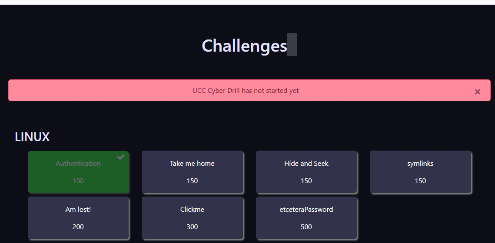

# Challenges

The Challenges Access feature organizes activities into various categories, enabling tailored access based on user roles, progress, or achievement levels. This setup helps instructors manage and sequence challenge content effectively. Key components include:

* **Categories:** Challenges are organized into categories, such as beginner, intermediate, or advanced, or by topic (e.g., coding, network security). This categorization allows users to select challenges aligned with their skill levels or interests.
* **Role-Based Access:** Different categories can be made accessible based on user roles, such as student, instructor, or admin, ensuring that only authorized users can view specific challenges.
* **Progress-Based Unlocking:** Challenges in advanced categories can be unlocked as users complete prerequisite tasks, helping to guide learning and prevent skipping levels.
* **Custom Access Rules:** Instructors can create custom rules for access, such as requiring specific achievements or prior challenge completion to enter a category, supporting a structured, goal-oriented learning experience.

