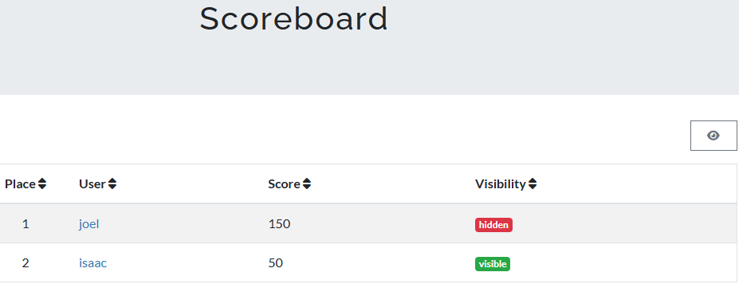

# Checking Boards

# Scoreboard
The Scoreboard feature provides a visual display of user performance and rankings, often used to encourage engagement and track progress in competitive or collaborative activities. Key aspects include:

* **Real-Time Ranking:** Users can see their position relative to others based on accumulated points, grades, or achievements, fostering motivation and friendly competition.
* **Points Allocation:** Points can be awarded for completing specific tasks, such as quizzes, assignments, or participation in discussions.
* **Leaderboard Customization:** Instructors can configure what information is displayed, such as scores, ranks, and badges, based on course objectives.
* **Privacy Settings:** Scoreboards may include privacy settings to control who can view individual scores or anonymize rankings if desired.

