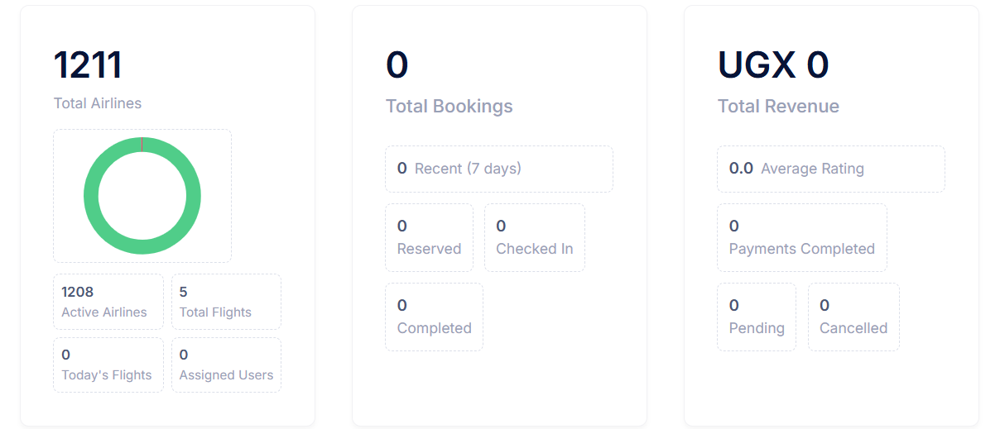

# Login & Registration

This guide will walk you through accessing and using our Moodle Learning Management System (LMS).


## Table of Contents
- [Accessing the Platform](#accessing-the-platform)
- [Login Process](#login-process)
- [New User Registration](#new-user-registration)
- [Password Recovery](#password-recovery)
- [Common Issues](#common-issues)

## Accessing the Platform

You can access our Moodle platform at:
```yourmoodledomain.com```



## Login Process

1. Navigate to the Moodle login page
2. Enter your credentials:
   - Username/Email
   - Password
3. Click "Log in" button

:::tip
Remember to keep your login credentials secure and never share them with others.
:::


### Single Sign-On (SSO)
If your institution uses SSO, you can click the "Login with [Institution Name]" button to use your institutional credentials.

## New User Registration

To create a new account:

1. Click "Create new account" on the login page
2. Fill in the required information:
   - Username (must be unique)
   - Password (must contain at least):
     - 8 characters
     - 1 digit
     - 1 lowercase letter
     - 1 uppercase letter
     - 1 special character
   - Email address
   - First name
   - Last name
3. Accept the terms and conditions
4. Click "Create my new account"
5. Check your email for verification link
6. Click the verification link to activate your account


:::caution
Make sure to use a valid email address as you'll need to verify it to complete registration.
:::

## Password Recovery

If you forget your password:

1. Click "Forgotten your username or password?" link
2. Enter your email address
3. Click "Search"
4. Check your email for password reset instructions
5. Click the reset link in the email
6. Enter your new password
7. Click "Save changes"


## Common Issues

### Can't Log In?
- Ensure caps lock is off
- Check if your username/email is correct
- Clear browser cache and cookies
- Try using a different browser

### No Verification Email?
- Check your spam folder
- Wait up to 15 minutes for delivery
- Contact support if email doesn't arrive

### Account Locked?
After multiple failed login attempts, your account may be temporarily locked. Wait 30 minutes and try again.

:::tip Getting Help
For technical support:
- Email: support@yourinstitution.com
- Phone: +1-XXX-XXX-XXXX
- Help Desk Hours: Monday-Friday, 9 AM - 5 PM
:::

## Security Best Practices

1. **Strong Passwords**
   - Use unique passwords
   - Change passwords regularly
   - Never share your credentials

2. **Secure Connection**
   - Always check for HTTPS
   - Avoid public Wi-Fi for login
   - Log out after each session

3. **Browser Security**
   - Keep your browser updated
   - Don't save passwords in browser
   - Clear browser data regularly