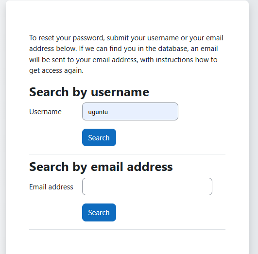

# Password Reset

The Password Reset feature allows users to securely regain access to their accounts if they forget their passwords. The process typically involves the following steps:

* **Initiate Reset:** Users can click the "Forgot Password" link on the login page to start the reset process.
* **Verification:** Users receive an email with a verification link or code to confirm their identity.
* **Set New Password:** After verification, users are prompted to create a new password, adhering to any required security guidelines (e.g., minimum length, special characters).
* **Confirmation:** Once the new password is set, users can log in with their updated credentials.

