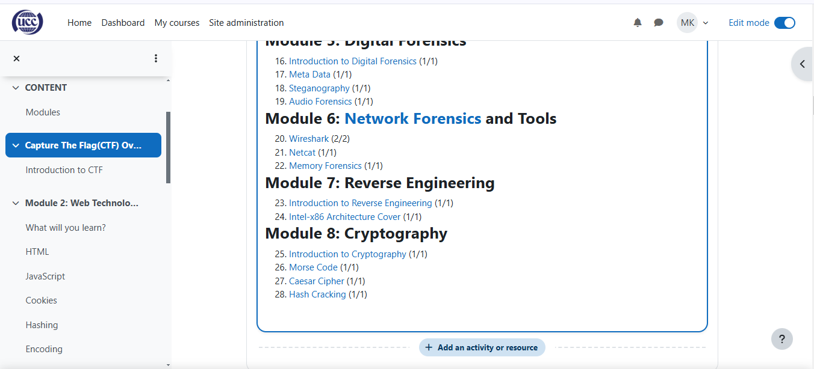

# CourseContent

# Parts of a course
1. **Course navigation.** These provide a quick way for the teacher to access important aspects of the course. The More link takes you to, for example, the Content and Question banks and Course reuse which incorporates Backup, Restore, Import, Reset and Copy.

2. **Course index.** This is a scrollable, collapsible drawer that displays course sections and elements. As you move up and down the central course area, your location is highlighted in the Course index. Clicking on an item in the Course index will open it up directly in the course central area. Sections in the course index can be collapsed or expanded in bulk from the kebab menu.

3. **Edit mode toggle.** An easy way to toggle edit mode on and off.

4. **Block drawer.** This is not visible until you have enabled edit mode and added a block. The block drawer can be collapsed and expanded as a user preference.

5. **Course sections**

Here is where the learning materials are displayed. This element may be arranged in one or multiple weeks, topics, forums or other (non-standard) layouts.

6. **Collapse all.** Sections can be collapsed and expanded individually or you can use the Collapse all link to collapse them all at once.

