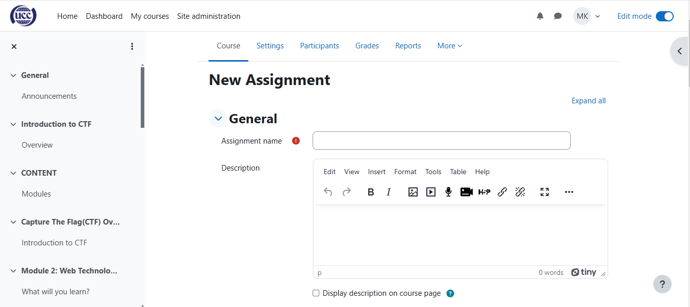

# AssignmentContent

The Grades feature enables users to view and manage their performance across various courses. It provides a centralized area for tracking progress, feedback, and results. Key components include:

* **Gradebook:** A tool for instructors to record and calculate students' grades. It offers options for adding, editing, and weighting grades based on assignments, quizzes, and other assessments.
* **Grading Scales:** Different grading scales (e.g., percentage, letter grade, pass/fail) can be set for each course to match the evaluation criteria.
* **Student View:** Students can access their individual grades, view instructor feedback, and track overall performance within a course.
* **Export Options:** Grades can be exported for reporting or analysis in formats like CSV or Excel.

Assignments allow instructors to create and manage coursework for students. Assignments can include written responses, file uploads, or multimedia submissions, with configurable due dates and grading criteria.

# Feedback
Feedback provides instructors with a way to give personalized responses to each student’s submission. Feedback can include comments, grades, and attachments, helping students understand their performance and areas for improvement.

# Availability
Availability settings determine when an assignment is accessible to students. Instructors can set specific open and close dates to control when students can view and submit their work.

# Notifications
Notifications keep users informed of important updates. Students receive alerts about upcoming due dates, assignment openings, and grades, ensuring they stay on track. Instructors can also receive notifications when submissions are received.

# Submission Settings
Submission settings allow instructors to specify the format and conditions for submitting assignments. This can include file types, word limits, single or multiple attempts, and any requirements for finalizing submissions.

