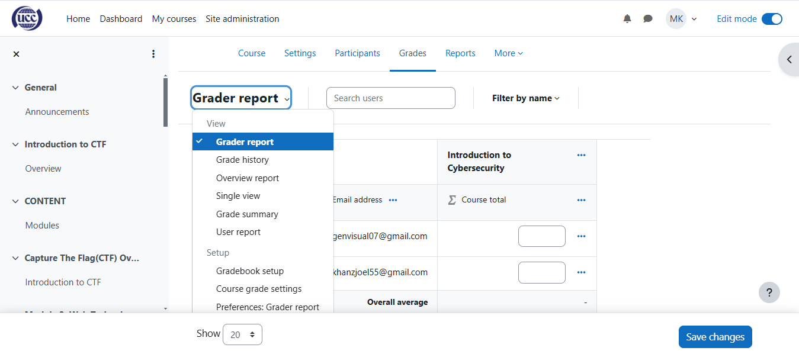

# Grade

The Grades feature enables users to view and manage their performance across various courses. It provides a centralized area for tracking progress, feedback, and results. Key components include:

* **Gradebook:** A tool for instructors to record and calculate students' grades. It offers options for adding, editing, and weighting grades based on assignments, quizzes, and other assessments.
* **Grading Scales:** Different grading scales (e.g., percentage, letter grade, pass/fail) can be set for each course to match the evaluation criteria.
* **Student View:** Students can access their individual grades, view instructor feedback, and track overall performance within a course.
* **Export Options:** Grades can be exported for reporting or analysis in formats like CSV or Excel.

