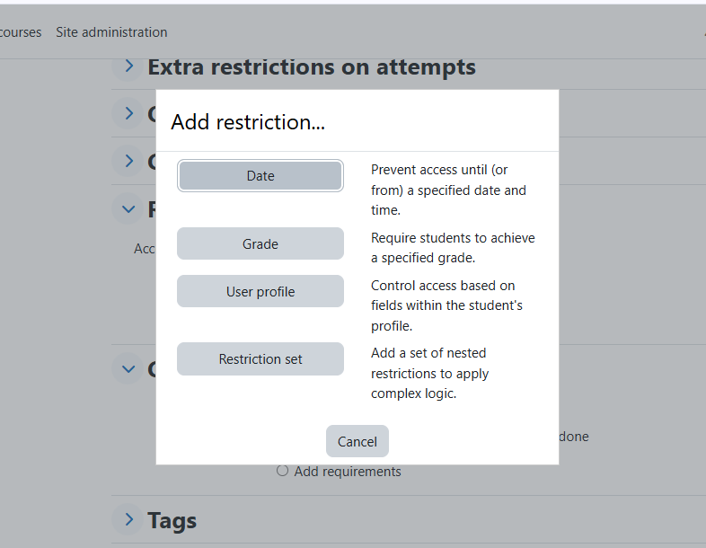
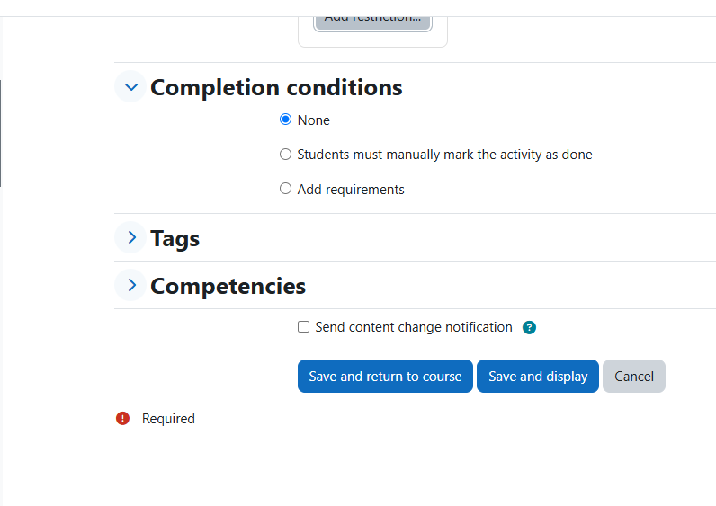

# Course Exit

# Restrict Access
The Restrict Access feature allows instructors to control who can access specific content based on conditions. This can be used to sequence learning or create a personalized experience for students. Conditions for access may include:

* **Date:** Content is only available after a specified date.
* **Grade Requirement:** Content is accessible only to students who achieve a certain grade in a previous activity.
* **User Profile:** Access based on user roles or group membership, allowing tailored content delivery.
* **Activity Completion:** Require completion of prior activities before unlocking new ones.

# Completion Condition
Completion Condition defines what students need to do to mark an activity or course as complete. It helps students and instructors track progress. Conditions can include:

* **View Requirement:** Students must view the content to mark it as complete.
* **Grade Achievement:** A minimum grade must be reached to satisfy the completion requirement.
* **Manual Marking:** Students manually mark the activity as complete once they feel they have finished it.
* **Submission Requirement:** Completion is based on submitting an assignment, quiz, or other activity

