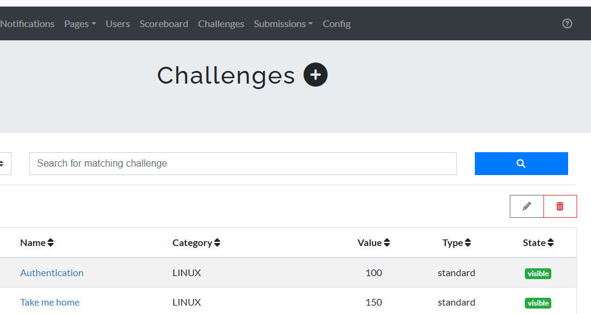

# Challenges Creation

The Challenges Creation feature allows instructors to design and add new challenges to the LMS, promoting active learning and skill development. Key steps in creating challenges include:

## Key Features

* **Define Challenge Details:** Instructors specify the challenge name, description, and objectives, giving users a clear understanding of the task.

* **Set Difficulty Level:** Assigning a difficulty level (e.g., beginner, intermediate, advanced) helps users select challenges that match their skill level.

* **Configure Access and Prerequisites:** Instructors can set prerequisites or conditions, such as requiring completion of previous challenges or specific role access.

* **Add Scoring and Feedback:** Define points, scoring criteria, and feedback options to provide users with meaningful performance metrics.

* **Test the Challenge:** Before publishing, instructors can preview and test the challenge to ensure it works as intended and provides the desired learning experience.

## Implementation Details

### Define Challenge Details
* Choose descriptive challenge name
* Write clear instructions
* Set specific learning objectives

### Set Difficulty Level
* Beginner level for fundamentals
* Intermediate for advancing skills
* Advanced for complex scenarios

### Configure Access
* Set completion requirements
* Define role access
* Establish prerequisites

### Scoring System
* Define point structure
* Create feedback mechanisms
* Set completion criteria

### Testing Process
* Preview functionality
* Verify scoring
* Validate learning outcomes

