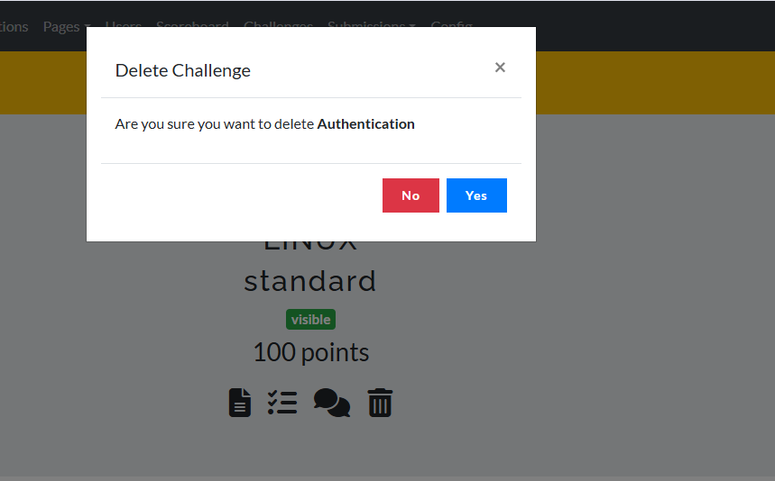

# Challenges Deleting

The Challenges Deletion feature enables instructors to remove outdated or irrelevant challenges, ensuring the LMS content remains relevant and organized. Key points include:

* **Access Deletion Options:** 
 Instructors can select the challenge to be deleted from the challenge management dashboard.

* **Confirmation Prompt:** 
 A confirmation step prevents accidental deletion, asking instructors to verify before permanently removing the challenge.

* **Impact on Users:** 
 If a challenge is in progress or completed by users, instructors may receive a warning about potential impacts, such as loss of scores or progress.

* **Archive Option:** 
 Some systems may allow archiving instead of deletion, so instructors can hide challenges from view without permanently removing them.

 
